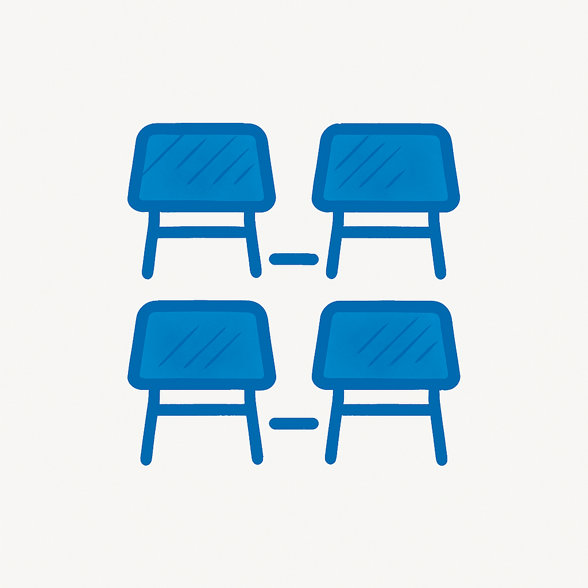

# 🪑 Klasopstelling Generator



> **De slimste manier om je klas in te delen.**
>
> Een krachtige, interactieve webapplicatie speciaal ontworpen voor docenten om snel en eenvoudig klasopstellingen te genereren, visualiseren en beheren.

---

## 📖 Over dit Project

De **Klasopstelling Generator** helpt docenten bij het maken van de perfecte plattegrond. Of je nu een vaste opstelling wilt, leerlingen willekeurig wilt plaatsen, of rekening wilt houden met specifieke wensen (zoals vaste plaatsen of leerlingen die niet naast elkaar mogen zitten) – deze tool maakt het mogelijk.

Geen gedoe meer met pen en papier of ingewikkelde Excel-sheets. Alles werkt direct in je browser, zonder installatie.

## ✨ Functionaliteiten

- **⚡ Direct aan de slag** — Geen account of installatie nodig.
- **🧠 Slimme algoritmes** — Willekeurige indelingen via het Fisher-Yates algoritme, met automatische conflictoplossing voor maximaal 500 pogingen.
- **📐 Keuze uit layouts** — Standaard opstellingen `2-2-2`, `2-3-2` en `3-3`, maak je eigen opstelling met **Eigen Opstelling** (eigen rijen en groepsgroottes), of gebruik de **Vrije Opstelling** met vrij te plaatsen tafels.
- **📌 Volledige controle**
  - Sleep leerlingen naar een andere plek (**Drag & Drop**) en maak dit ongedaan met **↩️ Ongedaan maken** of `Ctrl+Z`.
  - Stel **vaste plaatsen** in voor specifieke leerlingen.
  - **Scheid leerlingen** die niet naast elkaar mogen zitten.
- **🪑 Vrije Opstelling** — Voeg zelf tafels toe (horizontaal, verticaal of als raster), sleep ze naar de gewenste plek en zoom in of uit. Leerlingen worden automatisch verdeeld.
- **💾 Lijstbeheer** — Sla meerdere klassenlijsten op in je browser (inclusief vaste plaatsen en scheidingsparen) en laad ze wanneer nodig.
- **📸 Exporteren** — Download de actieve opstelling als **HD afbeelding** (3× schaal) om te printen of te projecteren. Bij de Vrije Opstelling wordt altijd de volledige indeling op ware grootte gedownload.

## 🚀 Aan de Slag

Open `index.html` direct in een moderne webbrowser (Chrome, Firefox, Edge, Safari). Er is geen installatie of server vereist.

Of gebruik de online versie: [plattegrondgenerator.netlify.app](https://plattegrondgenerator.netlify.app)

## 📚 Gebruikshandleiding

### 1. Leerlingen invoeren
Typ of plak de namen in het tekstvak (één naam per regel).
> *Tip: Kopieer de namen direct uit je administratiesysteem zoals Magister of Somtoday.*

### 2. Regels instellen (optioneel)
- **Vaste plaatsen** — Koppel een leerling aan een specifiek stoelnummer.
- **Scheiden** — Voeg een scheidingspaar toe zodat twee leerlingen nooit naast elkaar worden geplaatst.

### 3. Layout kiezen
Selecteer een tabblad:
- **2-2-2 / 2-3-2 / 3-3** — Vooraf ingestelde opstellingen.
- **Eigen Opstelling** — Stel zelf het aantal rijen en de groepsindeling in (bv. `2,3,2`) en klik op *Pas Layout Toe*.
- **Vrije Opstelling** — Voeg tafels toe en sleep ze naar de gewenste plek.

### 4. Genereren & aanpassen
Klik op **🎲 Genereer Opstellingen**. Niet tevreden? Klik nogmaals of sleep leerlingen handmatig naar een andere plek. Gebruik **↩️ Ongedaan maken** om een versleep terug te draaien.

### 5. Opslaan & delen
- **Lijstbeheer** — Geef de lijst een naam en sla hem op voor later gebruik.
- **📸 Download Plattegrond** — Exporteer de actieve tab als PNG-afbeelding.

## 🛠️ Technische Details

Volledig client-side — niets wordt naar een server gestuurd.

| Onderdeel | Technologie |
|---|---|
| Frontend | HTML5, CSS3 (CSS Custom Properties), Vanilla JS (ES6+) |
| Data opslag | `localStorage` API |
| Screenshot | `html2canvas` 1.4.1 (lokaal gehost) |
| Hosting | Netlify (met cache- en beveiligingsheaders via `netlify.toml`) |

### Bestandsstructuur

```
index.html          — Paginastructuur en HTML-templates
style.css           — Alle styling en animaties
app.js              — State management, generator-algoritme, UI-interacties
html2canvas.min.js  — Screenshot-bibliotheek (lokaal)
netlify.toml        — Netlify cache- en beveiligingsconfiguratie
```

### Klassen in `app.js`

| Klasse | Verantwoordelijkheid |
|---|---|
| `State` | Centrale state + localStorage persistentie |
| `NotificationSystem` | Toast-notificaties |
| `SeatingGenerator` | Plaatsingsalgoritme + DOM-rendering van stoelrasters en vrije opstelling |
| `TabManager` | Wisselen tussen de 5 layout-tabbladen (lazy rendering) |
| `ListManager` | Opslaan/laden/verwijderen van klassenlijsten |
| `EventHandlers` | Koppelt alle UI-events aan de logica |

## 🗺️ Wishlist

Ideeën voor toekomstige versies, van meest tot minst prioriteit:

### Hoge prioriteit
- [ ] **Exporteren/importeren van lijsten als bestand** (JSON of CSV) — zodat lijsten niet verloren gaan als de browser-opslag wordt gewist, en makkelijk gedeeld kunnen worden met collega's.
- [ ] **Afdrukweergave** — een schermvullende, knopvrije weergave speciaal voor printen of projecteren op een digibord, ook handig voor een invaller.

### Handige toevoegingen
- [ ] **Autocomplete bij vaste plaatsen en scheidingsparen** — namen worden automatisch aangevuld vanuit de ingevoerde leerlingenlijst.
- [ ] **Toetsenbordsnelkoppeling om opnieuw te genereren** — bijvoorbeeld `Ctrl+G`, zodat je niet steeds naar de knop hoeft.
- [ ] **Lege/geblokkeerde stoel** — markeer een stoel als niet beschikbaar (bv. kapotte stoel of een plek die vrij moet blijven).

### Beperkingen/constraints uitbreiden
- [ ] **"Moet naast elkaar zitten"-paren** — het omgekeerde van scheiden, handig voor buddy-systemen of taalondersteuning.
- [ ] **Voorste rij-markering** — geef aan welke leerlingen altijd vooraan moeten zitten (bv. voor slechtziende leerlingen).
- [ ] **Groepslabels** — deel leerlingen in op een label (bv. niveau of taalgroep) en zorg dat groepen evenredig verdeeld worden.

### Geavanceerd
- [ ] **Deelbare link** — sla de huidige opstelling op in de URL zodat je hem kunt delen zonder een bestand te hoeven sturen.
- [ ] **Meerdere lokalen/opstellingen per klassenlijst** — voor docenten die in meerdere lokalen lesgeven.
- [ ] **Vrije opstelling: tafels hernoemen** — geef een tafel een eigen naam (bv. "Tafel A").
- [ ] **Vrije opstelling: formaat aanpassen via slepen** — in plaats van via de instellingen.

## 🤝 Bijdragen

1. Fork dit project.
2. Maak een feature branch (`git checkout -b feature/nieuwe-functie`).
3. Commit je wijzigingen.
4. Open een Pull Request.

## ⚖️ Licentie

Dit project is gelicenseerd onder de **MIT License**.
Je bent vrij om dit project te gebruiken, aan te passen en te verspreiden, ook voor commerciële doeleinden, mits je de originele auteursvermelding behoudt.

---
*Gemaakt met ❤️ voor het onderwijs.*
