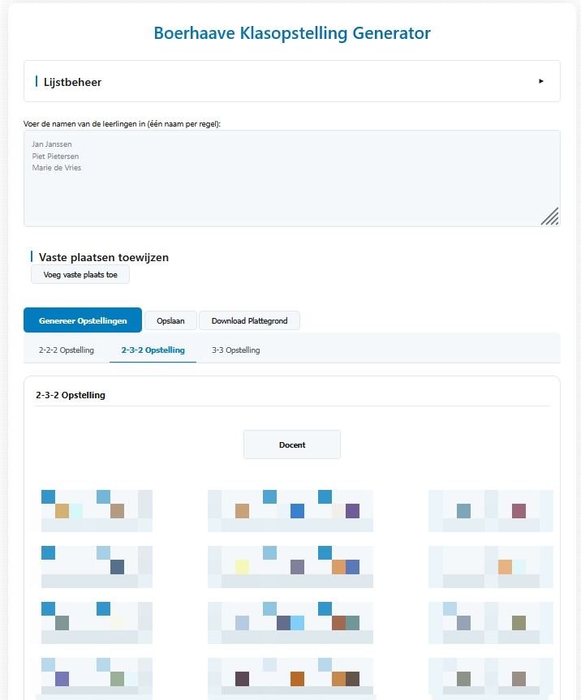

# 🪑 Klasopstelling Generator

Een interactieve webapplicatie waarmee je eenvoudig klasopstellingen kunt genereren op basis van leerlingenlijsten en vaste plaatsen. Speciaal ontworpen voor docenten die snel en visueel klasindelingen willen maken.

## ✨ Functionaliteiten

- 🎒 Leerlingen invoeren (één naam per regel)
- 📌 Vaste plaatsen instellen voor specifieke leerlingen
- 🧠 Drie verschillende opstellingslayouts: `2-2-2`, `2-3-2`, en `3-3`
- 🎲 Willekeurige plaatsing van overige leerlingen
- 💾 Opslaan en laden van lijsten
- 🌗 Donkere modus
- 📸 Download een afbeelding van de opstelling

## 🖼️ Voorbeeld

## 🚀 Gebruik

1. Open `index.html` in je browser (geen installatie nodig).
2. Voer de namen van leerlingen in.
3. (Optioneel) Voeg vaste plaatsen toe.
4. Kies een opstellingslayout en klik op **Genereer Opstellingen**.
5. Sla op, download of wissel van layout.

## 📁 Projectstructuur

- `index.html` – hoofdapplicatie (alles-in-één HTML, CSS & JS)
- Geen externe dependencies, behalve:
  - [`html2canvas`](https://github.com/niklasvh/html2canvas) (voor screenshots)

## 🛠️ Ontwikkelaarsinfo

Alle logica zit in de HTML-bestand, gestructureerd via klassen als:
- `State`
- `SeatingGenerator`
- `ListManager`
- `TabManager`
- `NotificationSystem`

## ⚖️ Licentie

MIT License – zie [LICENSE](./LICENSE)

> Vrij te gebruiken, delen en aanpassen. Ook voor commerciële toepassingen. Vermeld wel de originele auteur.

## 🙌 Dank & bijdragen

Voel je vrij om issues te melden of pull requests in te dienen. Feedback is welkom!

---
